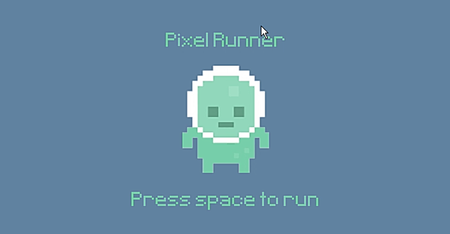
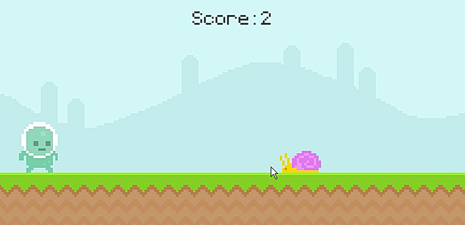
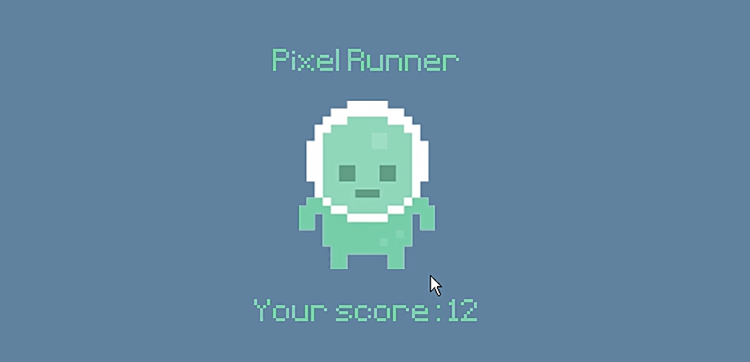

# PyRunnableGame
### This is My First PyGame Project

## 프로젝트 요약
 
> 2021.12.21 - 2021.12.28   
 
> **Python 개인 프로젝트**
* Python 기본 강의를 익히고 난 뒤에 진행한 첫 미니 프로젝트
* PyGame Package를 활용하여 제작
* 게임 화면은 800 * 400
* 게임 객체는 플레이어, 스네일, 파리로 구성되어 있음
* 게임 1프레임당 60초의 간격을 주었음
 

> **게임 로직 설명**
* 처음 게임 시작할 때에는 스페이스 키 누르면 게임 시작
* 플레이어가 장애물(스네일, 파리)에 닿지 않으면 점수 1씩 증가
* 플레이어는 스네일을 피할 때에는 점프(스페이스 키)로 피할 수 있고 파리는 어떠한 키를 누르지 않으면 알아서 피한다
* 플레이어가 장애물과 접촉하면 해당 점수가 저장되면서 게임 종료
 

## 시연영상
https://youtu.be/A3g2nBQb5fM

